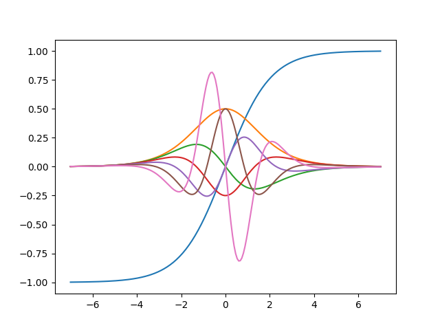

# hy_autograd
Efficiently computes derivatives with Hy

## Installation

```console
pip install -r requirements.txt
```

## Run

```console
hy tahn.hy
```

## Example 1

```hy
(import autograd.numpy :as np)
(import autograd [elementwise_grad :as egrad])
(import matplotlib.pyplot :as plt)

(defn tanh [x] (/ (- 1.0 (np.exp (- x))) (+ 1.0 (np.exp (- x)))))

(setv x (np.linspace -7 7 200))

(plt.plot
  x (tanh x)
  x ((egrad tanh) x)                                      ; first derivative
  x ((egrad(egrad tanh)) x)                               ; second derivative
  x ((egrad(egrad(egrad tanh))) x)                        ; third derivative
  x ((egrad(egrad(egrad(egrad tanh)))) x)                 ; fourth derivative
  x ((egrad(egrad(egrad(egrad(egrad tanh))))) x)          ; fifth derivative
  x ((egrad(egrad(egrad(egrad(egrad(egrad tanh)))))) x))  ; sixth derivative

(plt.savefig "tanh.png")

```


See the [tanh example file](https://github.com/HIPS/autograd/blob/master/examples/tanh.py) for the original code.

## Example 2

Example of calculating partial derivatives:

```hy
(import autograd [grad :as ∂])
(defn f [x y] (+ (** x 2) (** y 3)))
(setv  dx 0  dy 1)
(print ((∂ f dx) 1. 2.))
(print ((∂ f dy) 1. 2.))
```